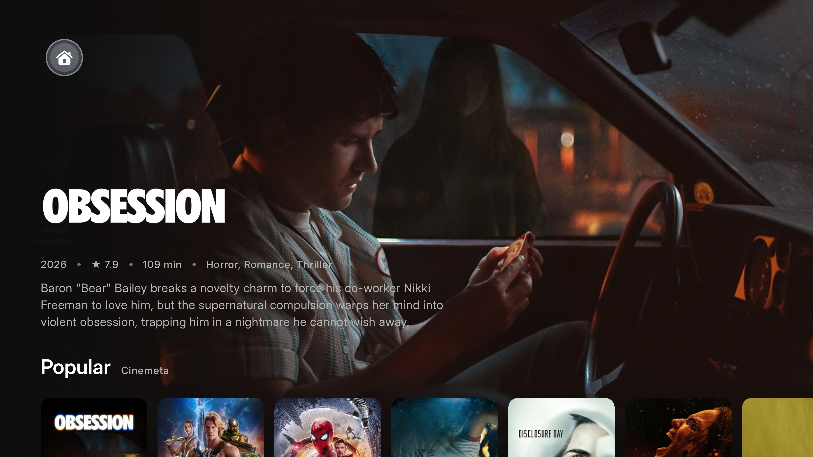

# Nuvio for Apple TV

A native tvOS client for the [Stremio addon](https://stremio.github.io/stremio-addon-guide/) ecosystem,
built to match the **NuvioTV** Android TV app as closely as tvOS allows.

Unlike the existing unofficial tvOS attempt, this is not a generic media-browser skin: the design
system, layout metrics, motion curves and screen structure are ported from the actual NuvioTV
Compose source, token for token.



## Install from a sideloading source

FlareStore, SideStore and other clients that understand the standard AltStore source format can
subscribe to the release feed directly:

```text
https://raw.githubusercontent.com/vatax3/NuvioTVOS/main/altstore-source.json
```

The source points only to unsigned IPA assets published by this repository. The installer still
has to sign the app with a tvOS-compatible certificate. FlareStore can then send it to a paired
Apple TV; SideStore understands the same catalog format, although the SideStore iOS client does
not itself deploy tvOS applications to an Apple TV.

Every published or edited GitHub release refreshes the source automatically. Version, build,
minimum OS, byte size, SHA-256 and release notes are taken from the release and its tagged
`Info.plist`, rather than maintained by hand.

## Why this is a rewrite, not a port

The four Nuvio codebases split across two stacks:

| App | Stack |
| --- | --- |
| NuvioTV (Android TV) | Native Android — Kotlin + Jetpack Compose (`androidx.tv`), ExoPlayer/Media3 + libmpv |
| NuvioMobile (Android + iOS) | Kotlin Multiplatform + Compose Multiplatform, MPVKit |
| NuvioMobile-iOS (unofficial) | Fork of NuvioMobile — same KMP codebase |
| NuvioTVOS (unofficial) | KMP attempt |

The Android TV app — the one this targets — is **Android-only**: ~222k lines of Kotlin bound to
`androidx.tv.material3`, Hilt, DataStore, Media3 and libmpv-android. Compose Multiplatform has no
supported tvOS target and `androidx.tv` components do not exist off Android, which is why the
existing KMP-based tvOS attempt does not reproduce the interface.

This project instead reimplements the app in SwiftUI so it can use the real tvOS focus engine,
while porting NuvioTV's design system verbatim so it *looks and measures* like the original.

### The density bridge

The single most important detail for visual fidelity. Android TV renders a 1920×1080 panel at
density 2.0, giving Compose a **960×540 dp** layout space. tvOS lays out in **1920×1080 points**.
Every `dp`/`sp` token therefore maps to exactly 2 tvOS points:

```swift
enum NuvioScale { static let dp: CGFloat = 2.0 }
func dp(_ value: CGFloat) -> CGFloat { value * NuvioScale.dp }
```

Every token in `Sources/DesignSystem/Tokens.swift` goes through that bridge, so a 126 dp poster
card is 252 pt here and occupies the identical fraction of the screen.

## Upstream parity

Reconciled through NuvioTV **`0.8.9-beta`** (2026-08-25). That means every upstream release up to
that tag has been read and each change ported, judged not applicable, or declined with a reason —
not that the two apps have the same feature set, which they cannot. The version lines are
independent on purpose: see [docs/UPSTREAM-PARITY.md](docs/UPSTREAM-PARITY.md) for the table and
for how to move the marker forward.

## What is ported

**Design system** — a 1:1 port of `ui/theme/`:

- `NuvioPrimitives` (full neutral ramp + status/source colors)
- All 7 accent palettes (Crimson, Ocean, Violet, Emerald, Amber, Rose, White) with AMOLED variants
- Spacing, radii, shapes, sizes, component, stroke, elevation, effect, layout and media tokens
- Motion durations and the four Compose easing curves, incl. the sidebar's distinct in/out timings
- Typography: the same **Inter / DM Sans / Open Sans** variable fonts as the Android app, with the
  `wght` axis pinned per weight so text renders identically instead of being synthetically bolded

**Stremio protocol** — a faithful port of the Android URL builders and manifest handling:

- `canonicalizeUrl` semantics (strips `/manifest.json`, preserves configurable-addon query strings)
- `catalog/{type}/{id}.json`, `/skip={n}.json` and `/{k=v&k2=v2}.json` extra-args forms
- `meta`, `stream` and `subtitles` endpoints, `resources` + `idPrefixes` gating
- `URLEncoder.encode(…).replace("+", "%20")` reproduced exactly
- Tolerant decoding for the ecosystem's loose JSON (`director` as string *or* array, `imdbRating`
  as string *or* number, `extra` as objects *or* bare strings), and per-item failure isolation so
  one malformed entry cannot blank a catalog

**Screens**

| Screen | Notes |
| --- | --- |
| Shell | Modern floating pill that blooms into the glass sidebar panel on D-pad Left; classic always-open rail as an option |
| Home | All three layouts — Modern (full-bleed hero), Classic, Grid |
| Detail | Hero + actions, seasons/episodes, cast, networks/studios, collections, comments, More like this |
| Cast | Person photo, biography and filmography (TMDB) |
| Browse | Paged TMDB listings for a network or studio |
| Streams | Grouped per addon and per scraper, quality/HDR/codec/size/seeder chips, debrid cache state |
| Player | Resume, progress persistence, per-stream proxy headers, Now Playing metadata, external subtitles, auto-play chaining |
| Comments | Trakt comments and reviews, spoilers hidden until revealed |
| Search | Debounced fan-out across every search-capable catalog |
| Discover | Browse any catalog by type and genre, standalone or folded into Search |
| Library | Saved titles, Continue Watching and collections |
| Settings | 12 sections: Addons, Appearance, Layout, Playback, Debrid, Plugins, Tracking, Metadata, Extras, Profiles, Experience, About |

Signature behaviours are preserved, including the **focus-hold poster expansion** (a card held in
focus for the configured delay widens to `height × 16/9` and reveals its backdrop, logo and
metadata) and the marquee-on-focus card titles.

**Feature surface**

- **~280 settings**, keyed to the same preference names as the Android DataStores. Playback alone
  covers engine and decoder, scaling and frame-rate matching, Dolby Vision profile 7 handling,
  audio selection/downmix, subtitle languages and styling, auto-play thresholds, buffer load
  control, network transport, VOD cache, external player and diagnostics. Every stored setting is
  consumed by the app — poster metrics, card depth, blur options and catalog naming all drive
  rendering.
- **Debrid** — Real-Debrid, Premiumize and TorBox: key validation, batch instant-availability, and
  magnet → HTTP resolution with file selection. The stream filter engine parses resolution,
  quality, HDR/DV, audio format and channels, encode, language, release group, size and seeders,
  then applies the required/excluded/preferred matrix, per-bucket caps and ranked sorting.
- **Tracking** — Trakt (device-code OAuth, scrobbling, progress and collection sources, comments)
  and Simkl (PIN auth, library lists, remote resume points and start/pause/stop scrobbling).
- **Metadata** — TMDB enrichment (artwork, logos, cast, certifications, recommendations, networks,
  studios), MDBList aggregated ratings, AniSkip intro/outro segments.
- **Subtitles** — external SubRip/WebVTT tracks from every `subtitles` addon, language-ordered and
  auto-selected, drawn with the configured size, weight, colours, outline and offset.
- **Plugins** — local JS scrapers in JavaScriptCore, matching the Android runtime's `getStreams`
  contract and injected globals, with a Swift HTML parser and CSS selector engine standing in for
  jsoup's `cheerio` shim.
- **Profiles** — separate library, progress, addons, collections and settings per profile, with
  optional PIN locking and restricted profiles.
- **Collections** — user-made folders, editable from the Library and the detail screen.
- **Account sync** — sign in by scanning a QR code with a phone (the same
  `start_tv_login_session` / `poll_tv_login_session` / `tv-logins-exchange` flow the Android app
  uses), then two-way sync of library, watch progress, collections, addons, plugin repositories
  and settings, per profile, at launch and when the player closes. Watch progress resolves per
  item by which device watched it most recently; library removals are tombstoned and pushed
  before the pull so a deletion cannot be undone by the next sync.

## Deliberate deviations

These are choices, not gaps — each one is a place where copying Android would have made the tvOS
app worse:

1. **Two playback engines, chosen per file.** NuvioTV runs ExoPlayer and libmpv side by side;
   this build does the same with AVFoundation and libmpv (rendered through MoltenVK). AVFoundation
   gets H.264/HEVC/HLS, where the system player also brings Siri Remote gestures, scrubbing
   preview and Now Playing for free; anything AVFoundation cannot demux — MKV above all — is
   routed to mpv, which carries Nuvio's own transport: a focusable, accelerating scrub bar, the
   Android control row, and the bottom-left audio and subtitle overlays. The transport is a port
   rather than a tvOS invention, including Menu's whole meaning during playback, which is decided
   in one place (`PlayerExitPolicy`) exactly as Android decides it in one `BackHandler`.
2. **Focus is the tvOS focus engine**, not a reimplementation of Compose's. `focusSection()` and
   the native engine give correct D-pad behaviour for free; Nuvio's *visual* focus treatment
   (2 dp accent ring, 1.02 scale, 8 dp elevation) is reproduced by hand because tvOS's stock
   `.card` style applies Apple's parallax lift, which looks nothing like Nuvio.
3. **The sidebar pill is itself the focus target.** On Android the pill is non-focusable and a
   `LEFT` key handler opens the panel. Here moving focus left lands on the pill and the panel
   expands around it — same interaction, no programmatic focus moves to fight the engine.

## Not implemented

A mechanical audit of what is missing, and of the settings that exist without a consumer, is in
[docs/FEATURE-AUDIT.md](docs/FEATURE-AUDIT.md) — including the fact that "collections" here and
"collections" upstream are different features that share a name.

The remaining differences are tracked in
[the parity audit](docs/PARITY-AUDIT.md). The four platform or product-level ones
that cannot be closed by simply porting another Swift view are:

1. **A debrid service is required for torrents**, by decision, and the decision is not
   reversible by porting anything. Android does not bundle a torrent library: it ships
   TorrServer as a native binary (`libtorrserver.so`) and starts it with `ProcessBuilder`. tvOS
   allows neither a subprocess nor downloaded executable code, so that design cannot be carried
   across at all. Torrents are playable here through Real-Debrid, Premiumize or TorBox. A
   torrent engine linked into the app would be a separate project rather than a port, and is
   not planned.
2. **Nuvio's own backend credentials.** Account sync itself is implemented (see below), but the
   official app's Supabase URL and publishable key are build-time secrets absent from its public
   source, so they cannot ship here. The Account screen asks for them — the official app exposes
   the same custom-server option, and a publishable/anon key is designed to live in the client.
3. **Inline trailer playback.** Trailers in the Stremio and TMDB data are YouTube ids. tvOS has no
   WKWebView and AVPlayer cannot resolve a YouTube watch page, so the detail-screen button hands
   off to the YouTube app instead, and the trailer-on-focus setting says it is unavailable rather
   than sitting inert.
4. **The complete `crypto-js` API inside the plugin runtime.** A native compatibility layer
   covers WordArray, the common hashes/HMACs, PBKDF2 and AES CBC/ECB/GCM. Less common algorithms
   such as DES/TripleDES and unimplemented npm surface still fail explicitly.

Smaller player gaps, all in the mpv transport: no sync-by-line subtitle timing dialog, no
playback issue reporting, and no torrent progress overlay. Startup and sustained-stall recovery now share
one bounded retry policy and resume from the live playhead. Frame-rate and dynamic-range matching
is wired to `AVDisplayManager` on both engines but has only been exercised on the simulator, which
has no display modes to switch between.

**Configuring from a phone.** tvOS has no web view and no usable keyboard, so anything that
needs typing is handed to a phone on the same network. The addon configurator renders the
addon's own configure URL as a QR code and takes the resulting manifest URL back. The stream
format editor goes further: the Apple TV serves the form itself over HTTP, and whatever the
phone saves lands straight in settings — which is the only sane way to enter a line like
`{stream.size::>0["{stream.size::bytes} "||""]}`.

## Verification status

The player's remote handling — which control owns focus in every state, and that a press with
the transport hidden brings it back — is checked on an Apple TV 4K simulator by driving the
remote itself; see `UITests/`. The UI, layout, subtitle, plugin and catalog paths are exercised
on the same simulator, and
the HTML/selector, subtitle and plugin-runtime code is checked against fixture inputs. The debrid,
Trakt, Simkl, TMDB, MDBList and Nuvio-account clients are written against the real APIs — the sync
layer against the Android source itself, so endpoints, RPC names and row shapes match — but have
**not** been run against live accounts or a live backend, because no credentials were available.
Treat those paths as untested.

## Build & run

Requires Xcode 26 with the tvOS SDK, plus [XcodeGen](https://github.com/yonaskolb/XcodeGen).

```bash
brew install xcodegen          # if needed
xcodegen generate
open NuvioTVOS.xcodeproj
```

From the command line:

```bash
xcodebuild -project NuvioTVOS.xcodeproj -scheme NuvioTVOS \
  -sdk appletvsimulator -destination 'platform=tvOS Simulator,name=Apple TV 4K (3rd generation)' \
  build
```

`project.yml` is the source of truth — `NuvioTVOS.xcodeproj` is generated and gitignored.

Tests:

```bash
xcodebuild -project NuvioTVOS.xcodeproj -scheme NuvioTVOS \
  -destination 'platform=tvOS Simulator,name=Apple TV 4K (3rd generation)' test
```

`Tests/` holds the unit tests. `UITests/` drives an actual Siri Remote through `XCUIRemote`,
because the player's remote handling only exists at runtime: whether a press reaches the
transport depends on where the tvOS focus engine has put focus, and no amount of reading the
view can answer that. Those tests launch straight into playback through a debug-only harness
(`PlayerHarness`, behind the `-nuvioPlayerHarness` launch argument) so no account, addon or
stream list stands between the test and the player.

Cinemeta and OpenSubtitles v3 are installed by default (the same defaults as
`AddonPreferences.getDefaultAddons()`). Add more under **Settings → Addons → Addon Manager**,
either by URL or from the shortlist of popular addons.

## Layout

```
Sources/
  App/            App entry, Router, root scaffold
  DesignSystem/   Token, theme and typography ports
  Domain/         Addon, Meta, Stream, Subtitle models
  Data/           Stremio client, addon/library/settings stores
  Features/       Shell, Home, Search, Library, Detail, Streams, Player, Settings
  Support/        Image loading, tolerant JSON, disk persistence
Resources/        Inter / DM Sans / Open Sans variable fonts, brand marks
```

## Legal

Nuvio is a client-side playback interface. It does not host, store or distribute media; all
content comes from addons the user chooses to install. Not affiliated with Stremio, nor with the
Nuvio project — this is an unofficial tvOS client.
